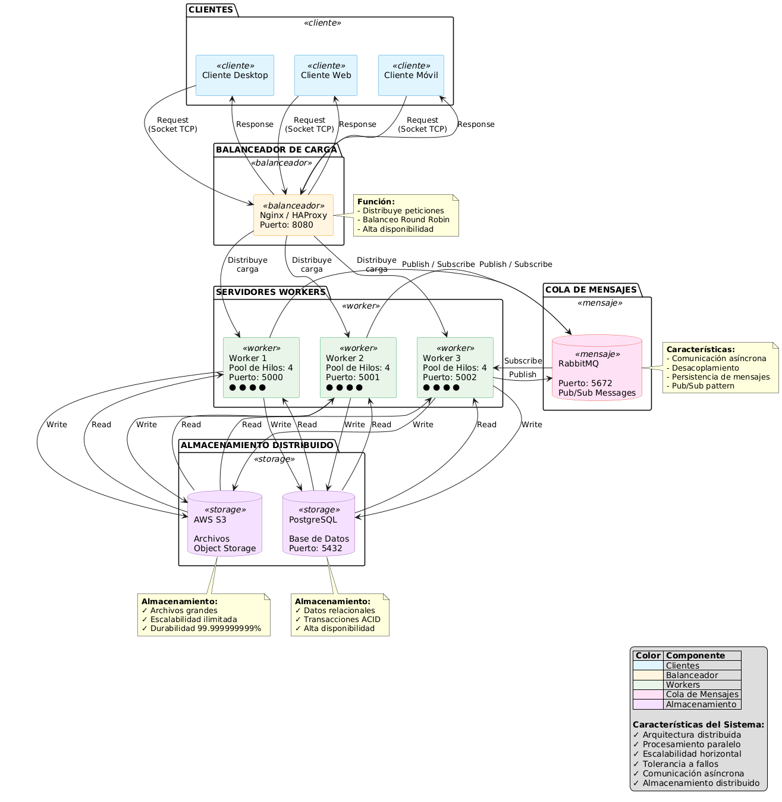

# PFO 3: Sistema Distribuido Cliente-Servidor

Sistema distribuido con arquitectura cliente-servidor implementado en Python usando sockets, RabbitMQ y pools de hilos.

## Descripción

Este proyecto implementa un sistema distribuido que permite:
- Enviar tareas desde clientes a servidores workers
- Procesar tareas en paralelo usando pools de hilos
- Comunicación entre servidores mediante RabbitMQ
- Balanceo de carga entre múltiples workers
- Almacenamiento distribuido con PostgreSQL y S3

## Arquitectura



### Componentes:

1. **Clientes**: Aplicaciones que envían tareas al sistema
2. **Balanceador de Carga**: Nginx/HAProxy distribuye peticiones
3. **Workers**: Servidores con pools de hilos para procesamiento paralelo
4. **RabbitMQ**: Cola de mensajes para comunicación asíncrona
5. **Almacenamiento**: PostgreSQL (datos) y S3 (archivos)

## Instalación

### Prerequisitos

- Python 3.8+
- Docker y Docker Compose (para RabbitMQ)
- pip

### 1. Clonar el repositorio

```bash
git clone https://github.com/romarvz/PFO3_Redes_Com_E_Romina_Zagordo.git
cd PFO3_Redes_Com_E_Romina_Zagordo
```

### 2. Crear entorno virtual

```bash
python -m venv venv
source venv/bin/activate  # En Windows: venv\Scripts\activate
```

### 3. Instalar dependencias

```bash
pip install -r requirements.txt
```

### 4. Levantar RabbitMQ con Docker

```bash
docker run -d --name rabbitmq \
  -p 5672:5672 \
  -p 15672:15672 \
  rabbitmq:3-management
```

Accede al panel de administración en: http://localhost:15672
- Usuario: `guest`
- Password: `guest`

### 5. Configurar variables de entorno (opcional)

Crea un archivo `.env`:

```env
SERVER_HOST=0.0.0.0
SERVER_PORT=5000
MAX_WORKERS=4
RABBITMQ_HOST=localhost
RABBITMQ_PORT=5672
```

## Uso

### Iniciar el Servidor

```bash
python server.py
```

El servidor estará escuchando en `localhost:5000`

### Iniciar el Cliente

En otra terminal:

```bash
python client.py
```

### Menú Interactivo del Cliente

```
1. Enviar cálculo (suma)
2. Enviar cálculo (multiplicación)
3. Enviar cálculo (promedio)
4. Procesar datos
5. Almacenar archivo
6. Ver estadísticas
7. Enviar múltiples tareas (prueba de carga)
0. Salir
```

## Tipos de Tareas

### 1. Cálculos Matemáticos

```python
# Ejemplo de uso programático
from client import TaskClient

client = TaskClient()
client.connect()

# Suma
task_id = client.send_calculation('sum', [10, 20, 30, 40])

# Multiplicación
task_id = client.send_calculation('multiply', [2, 3, 4, 5])

# Promedio
task_id = client.send_calculation('average', [100, 200, 300])
```

### 2. Procesamiento de Datos

```python
data = {
    'items': list(range(1000)),
    'filter': 'even'
}
task_id = client.send_data_processing(data)
```

### 3. Almacenamiento de Archivos

```python
task_id = client.send_file_storage('documento.txt', 'contenido del archivo')
```

## Configuración Avanzada

### Pool de Hilos

Modifica el número de workers en `server.py`:

```python
server = WorkerServer(host='0.0.0.0', port=5000, max_workers=8)
```

### Múltiples Servidores Workers

Puedes ejecutar múltiples instancias del servidor en diferentes puertos:

```bash
# Terminal 1
python server.py --port 5000

# Terminal 2
python server.py --port 5001

# Terminal 3
python server.py --port 5002
```

### Configurar Balanceador (Nginx)

Crea `/etc/nginx/nginx.conf`:

```nginx
upstream workers {
    server localhost:5000;
    server localhost:5001;
    server localhost:5002;
}

server {
    listen 8080;
    
    location / {
        proxy_pass http://workers;
        proxy_set_header Host $host;
        proxy_set_header X-Real-IP $remote_addr;
    }
}
```

## Monitoreo

### Estadísticas del Servidor

El servidor registra:
- Tareas procesadas
- Tareas fallidas
- Tamaño de la cola
- Workers activos

### Estadísticas del Cliente

El cliente registra:
- Total de tareas enviadas
- Tareas completadas
- Tareas fallidas
- Tareas pendientes

## Testing

### Prueba de Carga

Usa la opción 7 del menú del cliente para enviar múltiples tareas:

```
Número de tareas: 100
✓ 100 tareas enviadas en 0.15 segundos
Tasa: 666.67 tareas/seg
```

### Tests Automatizados

```bash
pytest tests/
```

## Estructura del Proyecto

```
pfo3-distributed-system/
├── server.py              # Servidor worker con pool de hilos
├── client.py              # Cliente para enviar tareas
├── rabbitmq_handler.py    # Manejo de cola de mensajes
├── requirements.txt       # Dependencias Python
├── README.md             # Esta documentación
├── diagrams/
│   └── architecture.png  # Diagrama de arquitectura
├── tests/
│   ├── test_server.py
│   └── test_client.py
└── .env.example          # Variables de entorno de ejemplo
```

## Autor

- Roma - [GitHub](https://github.com/romarvz)

## Recursos Adicionales

- [Documentación de Sockets Python](https://docs.python.org/3/library/socket.html)
- [RabbitMQ Tutorials](https://www.rabbitmq.com/getstarted.html)
- [Threading en Python](https://docs.python.org/3/library/threading.html)
- [Concurrent.futures](https://docs.python.org/3/library/concurrent.futures.html)